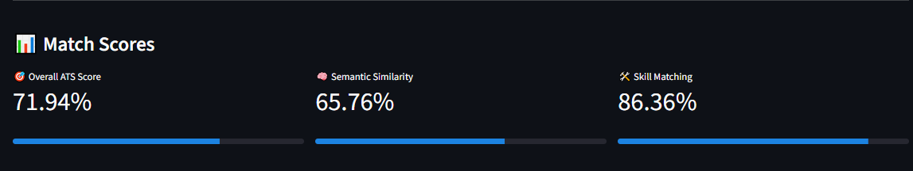
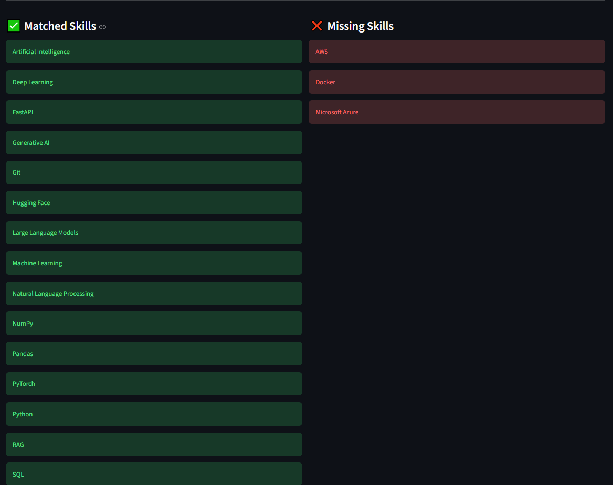

# 🤖 AI Resume Matcher (ATS)

> An AI-powered Applicant Tracking System (ATS) that analyzes resumes against job descriptions using **Natural Language Processing (NLP)**, **Semantic Embeddings**, and **Skill Matching**.

The application evaluates how well a resume matches a job description by combining **semantic similarity** and **technical skill matching**, then generates an ATS compatibility score along with actionable recommendations.

---

# ✨ Demo

> 🚧 Live Demo (Coming Soon)

---

# 📸 Screenshots

## 🏠 Home Page


---

## 📊 ATS Analysis Result



---

## 🧠 Resume Skills Detection



---

# 🚀 Features

### 📄 Resume Processing

- Upload Resume (PDF)
- Automatic PDF text extraction
- Resume structure analysis

### 🧠 Semantic Matching

- Sentence Embeddings
- Cosine Similarity
- Understands contextual meaning instead of keyword matching

### 🛠 Skill Matching

- Automatic technical skill extraction
- Matched skills detection
- Missing skills detection
- Resume vs Job Description comparison

### 📊 ATS Evaluation

- Overall ATS Score
- Semantic Similarity Score
- Skill Matching Score

### 💡 Smart Recommendations

- Resume improvement suggestions
- Missing technologies detection
- Better ATS compatibility feedback

---

# 🧠 System Architecture

```text
                  Resume PDF
                       │
                       ▼
              PDF Text Extraction
                       │
                       ▼
              NLP Preprocessing
                       │
          ┌────────────┴────────────┐
          ▼                         ▼
 Resume Skill Extraction     Job Skill Extraction
          │                         │
          └────────────┬────────────┘
                       ▼
               Skill Comparison
                       │
                       ▼
          Sentence Embedding Model
                       │
                       ▼
             Semantic Similarity
                       │
                       ▼
             ATS Score Calculation
                       │
                       ▼
             Resume Recommendations
```

---

# ⚙️ ATS Scoring Formula

The final score is computed using a weighted combination of semantic similarity and skill matching.

```text
Final ATS Score =
( Semantic Similarity × 70% )
+
( Skill Match × 30% )
```

---

# 🛠️ Tech Stack

## Programming Language

- Python

## Natural Language Processing

- spaCy
- Sentence Transformers
- Regex
- Embeddings

## Machine Learning

- Scikit-learn
- Cosine Similarity

## PDF Processing

- pdfplumber

## UI

- Streamlit

## Data Processing

- Pandas
- NumPy

---

# 📂 Project Structure

```text
ATS_Resume_Matcher/
│
├── assets/
│   ├── UI/
│   └── screenshots/
│
├── utils/
│   ├── embedding.py
│   ├── matcher.py
│   ├── pdf_loader.py
│   ├── score_engine.py
│   ├── recommendation.py
│   └── ...
│
├── app.py
├── requirements.txt
└── README.md
```

---

# 🚀 Installation

Clone the repository

```bash
git clone https://github.com/youssifshalaby/ATS_Resume_Matcher.git
```

Move into the project

```bash
cd ATS_Resume_Matcher
```

Create a virtual environment

```bash
python -m venv .venv
```

Activate the environment

### Windows

```bash
.venv\Scripts\activate
```

### Linux / macOS

```bash
source .venv/bin/activate
```

Install dependencies

```bash
pip install -r requirements.txt
```

---

# ▶️ Run the Application

```bash
streamlit run app.py
```

---

# 📊 Current Capabilities

✔ Resume PDF Upload

✔ PDF Text Extraction

✔ Resume Analysis

✔ Semantic Similarity

✔ Skill Extraction

✔ Matched Skills

✔ Missing Skills

✔ ATS Compatibility Score

✔ Resume Recommendations

✔ Resume Statistics

---

# 🔮 Roadmap (Version 2)

- [ ] DOCX Resume Support
- [ ] Experience Extraction
- [ ] Education Extraction
- [ ] Project Detection
- [ ] Soft Skills Detection
- [ ] Skill Synonym Matching
- [ ] Resume Ranking
- [ ] AI-powered Resume Feedback (LLMs)
- [ ] Cover Letter Generator
- [ ] Multi-language Support

---

# 👨‍💻 Author

**Youssef Ayman Shalaby**

AI Engineer | Machine Learning Engineer | Data Scientist

📧 Email: youssifshalabe@gmail.com

💼 LinkedIn: https://linkedin.com/in/youssifshalaby

💻 GitHub: https://github.com/youssifshalaby

---

# ⭐ Support

If you found this project helpful, consider giving it a ⭐ on GitHub.

It motivates me to continue building more AI and NLP projects.

---

## 📜 License

This project is licensed under the MIT License.
